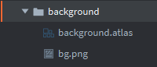
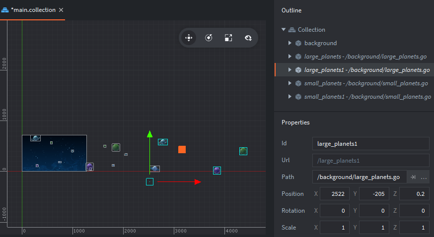
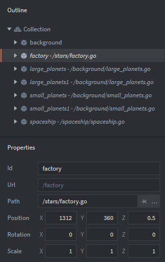
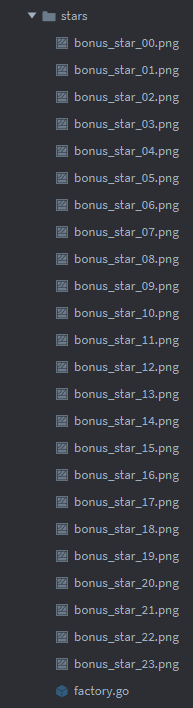
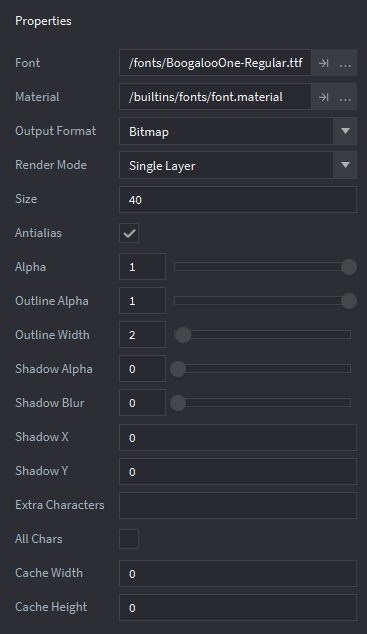
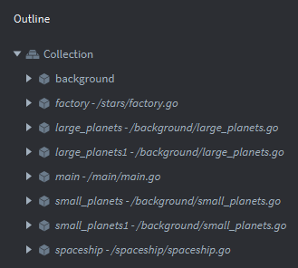

- [Defold's Side Scroller tutorial from scratch](#defold-s-side-scroller-tutorial-from-scratch)
  * [How to use this](#how-to-use-this)
  * [Steps of this project](#steps-of-this-project)
  * [Setting up the project](#setting-up-the-project)
    + [Opening the configuration file](#opening-the-configuration-file)
    + [Setting up the title](#setting-up-the-title)
    + [Setting up resolution](#setting-up-resolution)
    + [Setting up inputs](#setting-up-inputs)
  * [Setting up the background](#setting-up-the-background)
    + [Creating the background atlas](#creating-the-background-atlas)
    + [Adding the background to the main collection](#adding-the-background-to-the-main-collection)
  * [Setting up the background planets](#setting-up-the-background-planets)
    + [Adding the planets to the background atlas](#adding-the-planets-to-the-background-atlas)
    + [Creating a small planets background](#creating-a-small-planets-background)
    + [Adding two small_planets game objects to the main collection](#adding-two-small-planets-game-objects-to-the-main-collection)
    + [Creating a big planets background](#creating-a-big-planets-background)
    + [Adding two large planets game objects to the main collection](#adding-two-large-planets-game-objects-to-the-main-collection)
  * [Moving the planets](#moving-the-planets)
    + [Creating a script for the small planets game object](#creating-a-script-for-the-small-planets-game-object)
    + [Adding the script to the small planets game object](#adding-the-script-to-the-small-planets-game-object)
    + [Creating a script for the large planets game object](#creating-a-script-for-the-large-planets-game-object)
    + [Adding the script to the large planets game object](#adding-the-script-to-the-large-planets-game-object)
  * [Setting up the spaceship](#setting-up-the-spaceship)
    + [Creating the spaceship atlas](#creating-the-spaceship-atlas)
    + [Creating a spaceship game object](#creating-a-spaceship-game-object)
    + [Adding the spaceship to the main collection](#adding-the-spaceship-to-the-main-collection)
  * [Making the spaceship sway back and forth](#making-the-spaceship-sway-back-and-forth)
    + [Creating the spaceship's script](#creating-the-spaceship-s-script)
    + [Attaching the script to the spaceship game object](#attaching-the-script-to-the-spaceship-game-object)
  * [Making the spaceship respond to inputs](#making-the-spaceship-respond-to-inputs)
  * [Spawning stars](#spawning-stars)
    + [Creating the stars atlas](#creating-the-stars-atlas)
    + [Creating the star game object](#creating-the-star-game-object)
    + [Creating the star script](#creating-the-star-script)
    + [Attaching the script to the star game object](#attaching-the-script-to-the-star-game-object)
    + [Creating a factory](#creating-a-factory)
    + [Creating the factory script](#creating-the-factory-script)
    + [Attaching the factory script to the factory game object](#attaching-the-factory-script-to-the-factory-game-object)
    + [Adding the factory to the main collection](#adding-the-factory-to-the-main-collection)
  * [Spawning bonus stars](#spawning-bonus-stars)
    + [Adding the bonus star images to the stars atlas](#adding-the-bonus-star-images-to-the-stars-atlas)
    + [Creating the bonus star game object](#creating-the-bonus-star-game-object)
    + [Creating the bonus stars script](#creating-the-bonus-stars-script)
    + [Attaching the script to the bonus star game object](#attaching-the-script-to-the-bonus-star-game-object)
    + [Creating a bonus stars factory](#creating-a-bonus-stars-factory)
    + [Making the factory script spawn bonus stars too](#making-the-factory-script-spawn-bonus-stars-too)
  * [Managing collisions](#managing-collisions)
    + [Adding a collision object to the spaceship](#adding-a-collision-object-to-the-spaceship)
    + [Adding a collision object to the star](#adding-a-collision-object-to-the-star)
    + [Modify the star script to manage collision](#modify-the-star-script-to-manage-collision)
    + [Adding a collision object to the bonus star](#adding-a-collision-object-to-the-bonus-star)
    + [Modify the bonus star script to manage collision](#modify-the-bonus-star-script-to-manage-collision)
  * [Adding particles effect when stars collides with the spaceship](#adding-particles-effect-when-stars-collides-with-the-spaceship)
    + [Creating the particle resource](#creating-the-particle-resource)
    + [Adding the particle effect to the star game object](#adding-the-particle-effect-to-the-star-game-object)
    + [Modify the star script to play the particle effect when collision occurs](#modify-the-star-script-to-play-the-particle-effect-when-collision-occurs)
    + [Adding the particles effect to the bonus star game object](#adding-the-particles-effect-to-the-bonus-star-game-object)
    + [Modify the bonus star script to play the particles effect when collision occurs](#modify-the-bonus-star-script-to-play-the-particles-effect-when-collision-occurs)
  * [Managing the score](#managing-the-score)
    + [Moving the score font](#moving-the-score-font)
    + [Creating the score font](#creating-the-score-font)
    + [Creating a gui resource](#creating-a-gui-resource)
    + [Creating a gui game object](#creating-a-gui-game-object)
    + [Adding the gui game object to the main collection](#adding-the-gui-game-object-to-the-main-collection)
    + [Modifying the star script to send points to the gui](#modifying-the-star-script-to-send-points-to-the-gui)
    + [Modifying the bonus star script to send points to the gui](#modifying-the-bonus-star-script-to-send-points-to-the-gui)
    + [creating the gui script to update and animate the score](#creating-the-gui-script-to-update-and-animate-the-score)
    + [Adding the gui script to the gui game object](#adding-the-gui-script-to-the-gui-game-object)
  * [Congratulations](#congratulations)

# Defold's Side Scroller tutorial from scratch

This tutorial is a humble attempt to deconstruct the *Defold*'s [Side Scroller Tutorial](https://github.com/defold/tutorial-side-scroller). Its purpose is to try to recreate step by step that project from scratch in order to better understand how it was made and by doing so to better understand how to use *Defold*.

To follow this, you need at the very least to:

- have downloaded [Defold](https://www.defold.com/),
- have followed the [Side Scroller tutorial](https://github.com/defold/tutorial-side-scroller),
- know the different [views of the editor](https://www.defold.com/manuals/editor/).

**Note:** All assets needed for this project are provided inside the `assets` folder.

Let's get started!

## How to use this

For the easiest workflow, simply download this full repository and open the project inside *Defold*. Then open the `README.md` file provided and follow along the explanations. Remember that you can split the `Editor` view of *Defold* to read the tutorial while you're editing your project (right click on a tab and choose `Move to Other Tab Pane`).

You can also read this tutorial on your favorite browser but in that case you'll have to download the assets contained inside the `assets` folder of this repository, create an empty project in *Defold* and finally import manually the assets in your project.

## Steps of this project

Making a game is a complex process. You'll need to divide your project into small managable steps. Here is how this project was divided for you to better digest it:

- Settings
- Space background
- Planets
- Spaceship
- Stars
- Collisions
- Particles effect
- Score

Keep in mind there is no absolute way to make a game. You can start any way you want but sooner or later you'll need to organize the different parts into a cohesive whole.

## Setting up the project

### Opening the configuration file

The provided project is based upon the standard empty project template. You'll need to do some adjustments.

- In the `Assets` view, double click the `game.project` file.


### Setting up the title

The default title is `empty`. set it to `Side Scroller tutorial`:

- In the `Editor` view, under the `project` section, set the `Title` field to `Side Scroller tutorial`.


### Setting up resolution
 
The default resolution is set to 960x640. Change it to 1280x720:

- In the `Editor` view, under the `display` section, set the `Width` field to `1280` and the `Height` field to `720`.


- Save and close the configuration file.

Test your game:

- Click the `Project` > `Build` menu to check the title of the window and its resolution.
- Close your game.

### Setting up inputs

Set the up and down input bindings for the spaceship controls:

- In the `Assets` view, inside the `input` folder, double click on the `game.input_binding` file.


- In the `Editor` view, under `Key Triggers` section, click the `+` button twice to add two bindings.
  - In the `Input` column, set a value to `key-up` in the drop down menu.
  - In the `Action` column, enter the string `up`.
  - In the `Input` column, set a value to `key-down` in the drop down menu.
  - In the `Action` column, enter the string `down`.
- Under `Gamepad Triggers` section, click the `+` button twice to add two bindings.
  - In the `Input` column, set a value to `gamepad-lpad-up` in the drop down menu.
  - In the `Action` column, enter the string `up`.
  - In the `Input` column, set a value to `gamepad-lpad-down` in the drop down menu.
  - In the `Action` column, enter the string `down`.


- Save and close the `game.input_binding` file.

**Note:** The default `touch` action under the `Mouse Triggers` section has been removed from the previous screenshot for you to better see the other actions but you can leave it in your input bindings. It is not used in the game.

Everything is now properly set up. You can start making your game.

## Setting up the background

In this section, you'll create a fixed space background sprite and add it to the main collection.

### Creating the background atlas

To better organize your project, create a `background` folder that will hold all resources related to the background:

- In the `Assets` view, right click the root folder of the project and select `New Folder`.
- In the `New Folder` dialog, name that folder `background` and click the `OK` button.
- In the `Assets` view, drag the `bg.png` file from the `assets` folder to the `background` folder.

An image resource cannot be used directly. You have to insert it inside an *atlas* resource before. Create a `background.atlas` resource:

- Right click the `background` folder and select `New...` > `Atlas`.
- In the `New Atlas` dialog, name that atlas `background.atlas` and click the `OK` button.



Add the `bg.png` image into the atlas:

- In the `Outline` view, right click the `Atlas` resource and select `Add Images...`.
- In the `Select images` dialog, select the `bg.png` file and click the `OK` button.
- Select the `View` > `Frame Selection` menu to center the `Editor` view on the background image.
- Save and close the atlas.


### Adding the background to the main collection

Open the main collection:

- In the `Assets` view, double click the `main.collection` file to open it inside the editor.


 Create a `background` game object:

- In the `Outline` view, right click the `Collection` and select `Add Game Object`.
- In the `Properties` view, change the `Id` property of the `go` game object to `background`.

Add a sprite component to the game object:

- In the `Outline` view, right click the `background` game object and select `Add Component` > `Sprite`.

Set the image of the sprite component:

- In the `Properties` view, to the right of the `Image` property of the new `sprite` component, click the `...` button.
- In the `Select Resource` dialog, select the `background.atlas` resource and click the `OK` button.
- Set the `Default Animation` property drop down menu to `bg`.


Test your game:

- Select the `Project` > `Build` menu to check if your game displays the space background.
- Close your game.

The background sprite is by default centered on the game object which is itself by default positioned at the origin. The default camera however shows the origin in its bottom left corner. Thus, the background image is not entirely visible. You have to change the game object's position (at half the game's resolution) to display the space background image properly:

- In the `Outline` view, select the `background` game object.
- In the `Properties` view, set the `Position` sub-property `X` to `640` and `Y` to `360` of the `background` game object.
- Save and close the collection.


Test your game:

- Select the `Project` > `Build` menu to check if your game displays the space background entirely.
- Close your game.

## Setting up the background planets

Now, you'll create two planets *layers*. One will be scaled down to simulate depth. Both will slowly move to the left of the screen (at different speeds). When they get out of sight, their position is reset to the right of the screen for a neverending scrolling effect.

### Adding the planets to the background atlas

Move the planets images into the `background` folder:

In the `Assets` view, drag the `earthlike_planet.png`, `gas_planet.png`, `ice_planet.png` and `ring_planet.png` files from the `assets` folder to the `background` folder.


Add the planet images to the background atlas resource:

- In the `Assets` view, inside the `background` folder, double click the `background.atlas` atlas to open it inside the editor.
- In the `Outline` view, right click the `Atlas` resource and select `Add Images...`.
- In the `Select images` dialog, choose the `earthlike_planet.png`, `gas_planet.png`, `ice_planet.png` and `ring_planet.png` files and click the `OK` button.
- In the `Outline` view, select the `Atlas` resource.
- Select the `View` > `Frame Selection` to center the `Editor` view on the full atlas.
- Save and close the atlas.


### Creating a small planets background

Group multiple planet sprites to create a planets *layer*.

Create a game object resource to hold the planet sprites:

- In the `Assets` view, right click the `background` folder and select `New...` > `Game Object`.
- In the `New Game Object` dialog, name the game object `small_planets.go` and click the `OK` button.

Add a sprite component to the game objet:

- In the `Outline` view, right click the `Game Object` game object and select `Add Component` > `Sprite`.

Set the sprite component's image:

- In the `Properties` view, to the right of the `Image` property, click the `...` button.
- In the `Select Resource` dialog, select the `background.atlas` resource and click the `OK` button.
- In the `Properties` view, click the `Default Animation` property drop down menu and select any of the planets.

Set the sprite component's position:

In the `Editor` view, move the planet sprite to your liking (between `0` and around `4000` X-wise and between `0` and around `2000` Y-wise).

Duplicate the sprite component:

- In the `Outline` view, right click the `sprite` component and select `Copy`.
- Right click the `Game Object` game object and select `Paste`.

Change the duplicated sprite component's image:

- In the `Properties` view, click the `Default Animation` property drop down menu and select another planet.

Set the duplicated sprite component's position:

- In the `Editor` view, move the new planet sprite to your liking.

Repeat the three previous steps to add as much planet sprites as you want.

- Save and close the game object.


### Adding two small_planets game objects to the main collection

Add a `small_planets` game object to the main collection:

- In the `Assets` view, inside the `main` folder, double click the `main.collection` file to open it inside the editor.
- In the `Outline` view, right click the `Collection` and select `Add Game Object File`.
- In the `Select Game Object File` dialog, select the `small_planets.go` game object and click the `OK` button.
- In the `Outline` view, select the new `small_planets` game object.
- In the `Properties` view, set the `Position` sub-property `Z` to `0.1`.
- Set also all the `Scale` sub-properties to `0.3`.
- In the `Editor` view, move the `small_planets` game object to make the planets appear in front of the space background (for example, set the `Position` sub-property `X` to `236` and `Y` to `60`).

**Note:** Since the `background` game object has a `Z` position set to `0`, setting the `small_planets` game object's `Z` position to `0.1` makes the planets appear in front of the space background.


During scrolling, when the rightmost planet will get out of sight, the game object will be repositionned to the right of the space background. However, during that time there will be no more planet displayed on screen. So you'll effectively need two `small_planets` game objects to simulate a flowless scrolling.

Duplicate the small planets game object instance:

- In the `Outline` view, right click the `small_planets` game object and select `Copy`.
- Right click the `Collection` and select `Paste`.
- In the `Properties` view, set the `Position` sub-property `Z` of the `small_planets1` game object to `0.1`.
- In the `Editor` view, move the `small_planets1` game object to make the planets appear to the right of the space background (for example, set the `Position` sub-property `X` to `1290` and `Y` to `-7`).
- Save and close the collection.

**Note:** Since the `background` game object has a `Z` position set to `0`, setting the `small_planets1` game object's `Z` position to `0.1` makes the planets appear in front of the space background.


Test your game:

- Click the `Project` > `Build` menu to check if your game displays the small planets.
- Close your game.

### Creating a big planets background

The other planets *layer* will be an altered copy of the first one. Duplicate the `small_planets.go` game object:

- In the `Assets` view, inside the `background` folder, right click the `small_planets.go` resource and select `Copy`.
- Right click the `background` folder and select `Paste`.
- Right click the new `small_planets_copy.go` file and select `Rename...`.
- In the `Rename File` dialog, rename the game object to `large_planets.go` and click the `Rename` button.

Edit the game object to make it look different from the original:

- Double click the `large_planets.go` resource to open it inside the editor.
- In the `Outline` view, select any planet sprite.
- In the `Editor` view, move the planet to your liking (between `0` and around `2500` X-wise and between `0` and around `750` Y-wise).
- Repeat the two previous steps to move as much planet sprites as you want.
- Save and close the game object.


**Note:** You can also add or delete sprite planets and change their image if you want. Be creative!
  
### Adding two large planets game objects to the main collection

Open the main collection:
  
- In the `Assets` view, inside the `main` folder, double click the `main.collection` to open it inside the editor.

Create a large planets game object inside the main collection:

- In the `Outline` view, right click the `Collection` and select `Add Game Object File`.
- In the `Select Game Object File` dialog, select the `large_planets.go` game object and click the `OK` button.

Set the game object's position:

- In the `Outline` view, select the new `large_planets` game object.
- In the `Properties` view, set the `Position` sub-property `Z` to `0.2`.
- In the `Editor` view, move the `large_planets` game object to make its leftmost planet appear on the left side of the space background (for example, set the `Position` sub-property `X` to `12` and `Y` to `-131`). 


As for the small planets, during scrolling, when the rightmost planet will get out of sight, the game object will be repositionned to the right of the space background. However, during that time there will be no more planet displayed on screen. So you'll effectively need two `large_planets` game objects to simulate a flowless scrolling.

Duplicate the large planets game object:

- In the `Outline` view, right click the `large_planets` game object and select `Copy`.
- Right click the `Collection` and select `Paste`.

Set the duplicated game object's position:

- In the `Properties` view, set the `Position` sub-property `Z` of the new `large_planets1` game object to `0.2`.
- In the `Editor` view, move the `large_planets1` game object to make the planets appear to the right of the `large_planets` game object (for example, set the `Position` sub-property `X` to `2522` and `Y` to `-205`).
- Save and close the collection.



Test your game:

- Click the `Project` > `Build` menu to check if your game displays two different sized planets.
- Close your game.

## Moving the planets

Now, you'll create your first script to move the planets game objects to the left and reset their position to the right when they get out of sight.

### Creating a script for the small planets game object

Create a script for the small planets:

- Right click the `background` folder and select `New...` > `Script`.
- In the `New Script` dialog, name that script `small_planets.script` and click the `OK` button.
- In the `Editor` view, erase everything and enter the following code:

```lua
local speed = -30

function update(self, dt)
    local p = go.get_position()
    -- apply the speed
    p.x = p.x + speed * dt
    -- reset clouds to far right when they reach the far left to create infinite scrolling
    if p.x <= -1280 then
        p.x = 1280
    end
    go.set_position(p)
end
```

- Save and close the script.

**Code analysis:**

- The `local speed = -30` statement sets the `speed` variable's value to `-30`. It defines the movement's speed of the small planets. Modify its value to change their speed.
- The `update` function is called each display's frame. This is where everything is happening.
- The `local p = go.get_position()` statement gets the current position (as a `vector3` type) of the `small_planets` game object into a useful variable `p`.
- The `p.x = p.x + speed * dt` statement adds to the current `x` position, the speed multiplied by the *delta time* (to make the speed framerate independent).
- The `if p.x <= -1280 then...end` statement checks if the position's `x` value has not crossed the `-1280` threshold.
- The `p.x = 1280` statement resets the game object's position to the right. It occurs only if the previous statement's check is true.
- Finally, the `go.set_position(p)`  statement sets the game object's position to the new value held inside `p`.

Put simply, this code updates the game object's position each frame by changing its `x` component. If the position gets too much on the left, it gets reset back on the right.

**Note:** The *delta time* is the time elapsed between the current frame and the previous one. It is a very useful value to ensure the game flows at the same speed on slow and fast computers.

### Adding the script to the small planets game object

To make the script useful, you have to attach it to a game object. Since it's a script for the small planets, let's attach it to the `small_planets` game object:

- In the `Assets` view, inside the `background` folder, double click the `small_planets.go` file to open it inside the editor.
- In the `Outline` view, right click the `Game Object` game object and select `Add Component File`.
- In the `Select Component File` dialog, select the `small_planets.script` script and click the `OK` button.
- Save and close the game object.


Test your game:

- Click the `Project` > `Build` menu to check if your script makes the small planets move to left endlessly.
- Close your game.

### Creating a script for the large planets game object

Create a script for the large planets:

- In the `Assets` view, right click the `background` folder and select `New...` > `Script`.
- In the `New Script` dialog, name that script `large_planets.script` and click the `OK` button.
- In the `Editor` view, erase everything and enter the following code:

```lua
local speed = -60

function update(self, dt)
    local p = go.get_position()
    -- apply the speed
    p.x = p.x + speed * dt
    -- reset clouds to far right when they reach the far left to create infinite scrolling
    if p.x <= -1280 * 2 then
        p.x = 1280 * 2
    end
    go.set_position(p)
end
```

- Save and close the script.

**Code analysis:**

This code is almost the same as the `small_planets.script` script. Let's take a look at the specific parts.

- The `local speed = -60` statement sets the `speed` variable's value to `-60`. It defines the movement's speed of the large planets. Modify its value to change their speed.
- The `local p = go.get_position()` statement gets the current position (as a `vector3` type) of the `small_planets` game object into a useful variable `p`.
- The `p.x = p.x + speed * dt` statement adds to the current `x` position, the speed multiplied by the *delta time* (to make the speed framerate independent).
- The `if p.x <= -1280 * 2 then...end` statement checks if the position's `x` value has not crossed the `-2560` threshold.
- The `p.x = 1280 * 2` statement resets the game object's position to the right. It occurs only if the previous statement's check is true.

Put simply, this code does the same as the `small_planets.script` script but with some values changed since the `large_planets` game object has a different scale than the `small_planets` game object.

### Adding the script to the large planets game object

As for the small planets script, to make this script useful, you have to attach it to a game object. Since it's a script for the large planets, let's attach it to the `large_planets` game object:

- In the `Assets` view, inside the `background` folder, double click the `large_planets.go` file to open it inside the editor.
- In the `Outline` view, right click the `Game Object` game object and select `Add Component File`.
- In the `Select Component File` dialog, select the `large_planets.script` script and click the `OK` button.
- Save and close the game object.


Test your game:

- Click the `Project` > `Build` menu to check if your script makes the large planets move properly.
- Close your game.

## Setting up the spaceship

Now, let's take care of the spaceship. You'll put the spaceship images into an atlas as an animation group then you'll create a game object holding a sprite component to show the spaceship animation. Finally, you'll add this game object to the main collection.

### Creating the spaceship atlas

To better organize your project, create a `spaceship` folder that will hold all resources related to the spaceship:

- In the `Assets` view, right click the root folder of the project and select `New Folder`.
- In the `New Folder` dialog, name that folder `spaceship` and click the `OK` button.

Move all spaceship images into the `spaceship` folder:

- In the `Assets` view, drag all `spaceship_XX.png` files from the `assets` folder to the `spaceship` folder.

Create a new atlas:

- Right click on the `spaceship` folder and select `New...` > `Atlas`.
- In the `New Atlas` dialog, name that atlas `spaceship.atlas` and click the `OK` button.


Next, create an animation group:

- In the `Outline` view, right click the `Atlas` resource and select `Add Animation Group`.
- In the `Properties` view, change the `Id` property of the new animation group to `spin`.
- Change also the `Fps` property of the animation group to `30`.

 Add the spaceship images to the animation group:

- In the `Outline` view, right click the `spin` animation group and select `Add Images...`.
- In the `Select images` dialog, choose all the `spaceship_XX.png` files and click the `OK` button.


Check the spaceship animation:

In the `Outline` view, select the `Atlas` resource.
- Select the `View` > `Frame Selection` menu to center the `Editor` view on the whole atlas.
- In the `Outline` view, select the `spin` animation group.
- Select the `View` > `Play` menu to play the animation.
- Save and close the atlas.


### Creating a spaceship game object

Create a game object resource to hold the spaceship sprite:

- Right click on the `spaceship` folder and select `New...` > `Game Object`.
- In the `New Game Object` dialog, name that game object `spaceship.go` and click the `OK` button.

Add a sprite component to the new game object:

- In the `Outline` view, right click the `Game Object` resource and select `Add Component` > `Sprite`.
- In the `Properties` view, to the right of the `Image` property of the new sprite component, click the `...` button.
- In the `Select Resource` dialog, select the `spaceship.atlas` resource and click the `OK` button.
- Set the `Default Animation` property drop down menu to `spin`.
- Save and close the game object.


### Adding the spaceship to the main collection

Add the `spaceship.go` game object to the main collection:

- In the `Assets` view, inside the `main` folder, double click the `main.collection` file to open it inside the editor.
- In the `Outline` view, right click the `Collection` and select `Add Game Object File`.
- In the `Select Game Object File` dialog, select the `spaceship.go` game object and click the `OK` button.

Set the spaceship game objects properties:

- In the `Outline` view, select the new `spaceship` game object.
- In the `Properties` view, set the `Position` sub-property `X` to `209`, `Y` to `400` and `Z` to `0.5`.


- Save and close the collection.

**Note:** Setting the `Z` position to `0.5` makes the spaceship appear in front of everything else in the game.


Test your game:

- Click the `Project` > `Build` menu to check if your game displays the spaceship animated sprite.
- Close your game.

## Making the spaceship sway back and forth

Now that the spaceship is displayed inside your game, let's make it swing a little. For that, you'll use a simple script to animate automatically a property of the game object.

### Creating the spaceship's script

Create a script for the spaceship:

- In the `Assets` view, right click the `spaceship` folder and select `New...` > `Script`.
- In the `New Script` dialog, name that script `spaceship.script` and click the `OK` button.

 You just have to animate the `euler.z` property of the game object:

- In the `Editor` view, enter the following code:

```lua
function init(self)
    -- Animate the ship so it's swaying back and forth
    go.set(".", "euler.z", -5)
    go.animate(".", "euler.z", go.PLAYBACK_LOOP_PINGPONG, 5, go.EASING_INOUTSINE, 2)
end
```

- Save and close the script.

**Code analysis:**

- The `init` function is called only once when the game object is created. This is where you ask *Defold* to constantly update the right property for you.
- The `go.set(".", "euler.z", -5)` statement sets the game object's property `euler.z` to `-5`. This is just an initialization statement.
- The `go.animate(".", "euler.z", go.PLAYBACK_LOOP_PINGPONG, 5, go.EASING_INOUTSINE, 2)` statement is where the real magic happens. Let's dissect it a little more:
  - The `go.animate` function asks *Defold* to automatically animate a property based upon the parameters.
  - The `"."` argument simply targets the current game object which possess this script.
  - The `"euler.z"` argument targets that specific property from the game object. This is the Z-axis rotation property.
  - The `go.PLAYBACK_LOOP_PINGPONG` argument asks to interpolate the property back and forth end endlessly from its original value (set in the previous statement) and the following argument. For more information, check out the official documentation about the [Playback Modes](https://www.defold.com/manuals/animation/#_playback_modes).
  - The `5` argument is the maximum target value for the interpolation.
  - The `go.EASING_INOUTSINE` specifies the kind of interpolation to make. For more information, check out the official documentation about [Easing](https://www.defold.com/manuals/animation/#_easing).
  - Finally, the `2` argument specifies the time (in seconds) between the start and the end of an interpolation loop.

Put simply, this code asks *Defold* to interpolate back and forth the `euler.z` property of the game object between `-5` and `5`. Since that property controls the Z-axis rotation, it effectively makes the spaceship game object sway back and forth.

**Note:** You can change the `-5` and `5` values inside the script to control the amplitude of oscillation and the `2` value to control its oscillation's duration.

### Attaching the script to the spaceship game object

Attach the script to the `spaceship.go` game object:

- In the `Assets` view, inside the `spaceship` folder, double click the `spaceship.go` resource to open it inside the editor.
- In the `Outline` view, right click the `Game Object` game object and select `Add Component File`.
- In the `Select Component File` dialog, select the `spaceship.script` script and click the `OK` button.
- Save and close the game object.

Test your game:

- Click the `Project` > `Build` menu to check if your game displays the spaceship sprite and makes it sway back and forth.
- Close your game.

## Making the spaceship respond to inputs

Now that the spaceship's animation is ready, let's control it with actions. You already set the input bindings at the start of this tutorial so you now only have to edit the spaceship script to add input management.

Open and edit the spaceship script:

- In the `Assets` view, inside the `spaceship` folder, double click on the `spaceship.script` file to open it inside the editor.
- In the `Editor` view, erase everything and put the following code:

```lua
local max_speed = 200
local min_y = 60
local max_y = 600

function init(self)
	-- Let the script receive input from the player
	msg.post(".", "acquire_input_focus")
	-- the current speed of the space ship
	self.speed = 0
	
	-- Animate the ship so it's swaying back and forth
	go.set(".", "euler.z", -5)
	go.animate(".", "euler.z", go.PLAYBACK_LOOP_PINGPONG, 5, go.EASING_INOUTSINE, 2)
end

function update(self, dt)
	local p = go.get_position()
	p.y = p.y + self.speed * dt
	if p.y < min_y then
		p.y = min_y
	elseif p.y > max_y then
		p.y = max_y
	end
	go.set_position(p)
	self.speed = 0
end

function on_input(self, action_id, action)
	if action_id == hash("up") then
		self.speed = max_speed
	elseif action_id == hash("down") then
		self.speed = -max_speed
	end
end
```

- Save and close the script.

**Code analysis:**

- The `local max_speed = 200` statement sets the `max_speed` variable to `200`. This sets the speed of the spaceship.
- The `local min_y = 60` statement sets the `min_y` variable to `60`. This sets the lowest Y position the spaceship will be allowed to move down.
- The `local max_y = 600` statement sets the `max_y` variable to `600`. This sets the highest Y position the spaceship will be allowed to move up.
- The `init` function has two new statements.
  - `msg.post(".", "acquire_input_focus")` asks *Defold* to send the inputs to the game object. When a game object needs to respond to inputs, you always have to insert this statement.
  - `self.speed = 0` sets the current speed of the spaceship to `0`. So, by default, the spaceship game object doesn't move.
- The `on_input` function manages the input actions before the `update` function is called each frame. It is automatically called by the engine when an action occurs. Its parameters are used to get useful informations about the current action.
  - `if action_id == hash("up") then` checks if the *action id* is equal to `"up"` (that is, if the player has pushed the `UP` key). Internally in *Defold*, the actions strings are turned into *hashed* values so you'll often compare the action id against a hash with the `hash` function.
  - `self.speed = max_speed` sets the spaceship speed to the `max_speed` value only if the previous code check is true (that is, if the player has pushed the `UP` key).
  - `elseif action_id == hash("down") then` checks if the *action id* is equal to `"down"` (that is, if the player has pushed the `DOWN` key). This executes only if the `up` action didn't occurred in the first place.
  - `self.speed = -max_speed` sets the spaceship speed to the opposite of `max_speed` value only if the previous code check is true (that is, if the player has pushed the `DOWN` key).

So when the player pushes `UP` or `DOWN` keys , the spaceship's speed is set to the proper speed.

- The `update` function is where all the position update occurs.
  - `local p = go.get_position()` gets the game object's position (`vector3` type) and assigns it to the `p` variable.
  - `p.y = p.y + self.speed * dt` updates the `y` component of the game object's position with the current `speed` multiplied by the *delta time*.
  - `if p.y < min_y then` check if the `y` component of the game object's position hasn't crossed the threshold value set by `min_y`.
  - `p.y = min_y` sets the `y` component of the game object's position to a minimum value of `min_y` to prevent the spaceship to get outside of the screen.
  - `elseif p.y > max_y then` check if the `y` component of the game object's position hasn't crossed the threshold value set by `max_y`.
  - `p.y = max_y` sets the `y` component of the game object's position to a maximum value of `max_y` to prevent the spaceship to get outside of the screen.
  - `go.set_position(p)` sets the new position (held inside `p`) to the game object.
  - `self.speed = 0` resets the spaceship's speed to `0` since all input have been used in the current frame.

Put simply, the new statements makes the spaceship move up and down when the player presses `UP` or `DOWN` keys. It also prevents the spaceship of getting outside of the screen by clamping its `y` component's position between `min_y` and `max_y`.

Test your game:

- Click the `Project` > `Build` menu to check if your game allows you ton control the spaceship with `UP` and `DOWN` keys.
- Close your game.

**Note:** You can change the `max_speed` value to control the speed of the spaceship. The `max_y` and `min_y` values controls the upper and lower limits. you can also try to use the directional pad of a gamepad if you have one.

## Spawning stars

Now that the spaceship is properly animated and responds to the player's inputs, let's take care of the stars. you'll create a new atlas to hold the stars animation then you'll create a game object that will hold a star sprite and finally you'll add this game object to the main collection.

### Creating the stars atlas

To better organize your project, create a `stars` folder that will hold everything related to the stars:

- In the `Assets` view, right click on the root folder of the project and select `New Folder`.
- In the `New Folder` dialog, name that folder `stars` and click the `OK` button.

Move the star images into the `stars` folder:

- In the `Assets` view, drag all of the `star_XX.png` files from the `assets` folder to the `stars` folder.

 Create an atlas resource to hold the stars images:

- Right click on the `stars` folder and select `New...` > `Atlas`.
- In the `New Atlas` dialog, name that atlas `stars.atlas` and click the `OK` button.


Add the star images to the atlas:

- In the `Outline` view, right click the `Atlas` resource and select `Add Animation Group`.
- In the `Properties` view, set the `Id` property of the new animation group to `star`.
- Set also the `Fps` property to `30`.
- In the `Outline` view, right click the `star` animation group and select `Add Images...`.
- In the `Select images` dialog, select all the `star_XX.png` files and click the `OK` button.

Check the star animation:

- In the `Outline` view, select the `Atlas` resource.
- Select the `View` > `Frame Selection` menu to center the `Editor` view on the whole atlas.
- In the `Outline` view, select the `star` animation group.
- Select the `View` > `Play` menu to play the animation.
- Save and close the atlas.


### Creating the star game object

Create a new game object to hold the star sprite:

- In the `Assets` view, right click the `stars` folder and select `New...` > `Game Object`.
- In the `New Game Object` dialog, name the game object `star.go` and click the `OK` button.
- In the `Outline` view, right click the root `Game Object` and select `Add Component` > `Sprite`.
- In the `Properties` view, set the `Position` sub-property `Z` to `0.5`.
- To the right of the `Image` property, click the `...` button.
- In the `Select Resource` dialog, select the `stars.atlas` resource and click the `OK` button.
- In the `Properties` view, set the `Default Animation` property drop down menu to `star`.
- Save and close the game object.

**Note:** Setting the `Z` position to `0.5` makes the stars appear at the same depth as the spaceship inside the game.


### Creating the star script

Since the stars will spawn outside of the screen, you first need to make them move to the left so you can see them after a while. for that, you'll create a script similar to the planets' scripts: 

- In the `Assets` view, right click the `stars` folder and select `New...` > `Script`.
- In the `New Script` dialog, name the game object `star.script` and click the `OK` button.
- In the `Editor` view, erase everything and enter the following code:

```lua
local speed = -240

function update(self, dt)
	local p = go.get_position()
	p.x = p.x + speed * dt
	if p.x < -32 then
		go.delete()
	end
	go.set_position(p)
end
```

- Save and close the script.

**Code analysis:**

This code is almost identical to the planets scripts so let's see what is different.

- `local speed = -240` sets the stars movement's speed to `-240`. Nothing new except a different value.
- `if p.x < -32 then` checks if the star's position `x` component hasn't crossed the threshold value of `-32`. Again, nothing new except a different value. Since the stars are small sprites, the value is much less than the one for the planets.
- `go.delete()` deletes definitely the game object from the collection. This occurs only if the previous check was evaluated to true (that is, if the star gam object got outside of the screen to the left). 

Put simply, this code makes the star game object go left. If it crosses the threshold value `32`, it's being deleted from the game.

**Note:** You can change the `-speed` value inside the script to control the stars movement's speed.

### Attaching the script to the star game object

As always, you need to attach the script to make it useful.

- In the `Assets` view, inside the `stars` folder, double click the `star.go` game object to open it inside the editor.
- In the `Outline view`, right click the `Game Object` resource and select `Add Component File`.
- In the `Select Component File` dialog, select the `star.script` resource and click the `OK` button.
- Save and close the game object.


### Creating a factory

Up until now, you have directly added game objects you created inside the main collection. However, for the star game object, you'll need something to make it spawn indefinitely. this is done by using a `Factory` component inside a game object.

- In the `Assets` view, right click the `stars` folder and select `New...` > `Game Object`.
- In the `New Game Object` dialog, name the game object `factory.go` and click the `OK` button.


- In the `Outline` view, right click the `Game Object` resource and select `Add Component` > `Factory`.
- In the `Properties` view, set the `Id` property to `star_factory`.

The most important aspect of a `Factory` component is that you need to set its `Prototype` property to point to the game object file you want to spawn.

- To the right of the `Prototype` property, click the `...` button.
- In the `Select Resource` dialog, select the `star.go` resource and click the `OK` button.
- Save and close the game object.


### Creating the factory script

Now that the factory has a prototype game object, you need to create a script to control its behavior.

- In the `Assets` view, right click the `stars` folder and select `New...` > `Script`.
- In the `New Script` dialog, name the script `factory.script` and click the `OK` button.
- In the `Editor` view, replace the code by the following one:

```lua
local frequency = 0.5
local min_y = 60
local max_y = 600

function init(self)
	self.timer = 1/frequency
	-- make the game deterministic
	math.randomseed(0)
end

function update(self, dt)
	self.timer = self.timer - dt
	if self.timer <= 0 then
		self.timer = 1/frequency
		local p = go.get_position()
		p.y = vmath.lerp(math.random(), min_y, max_y)
		local component = "#star_factory"
		factory.create(component, p)
	end
end
```

- Save and close the script.

[A COMPLETER]()

**Code analysis:**

- `...` ....

Put simply, this code ....

**Note:** ....


### Attaching the factory script to the factory game object

Now that you've written the script, attach it to the game object.

- In the `Assets` view, inside the `stars` folder, double click the `factory.go` game object to open it inside the editor.
- In the `Outline view`, right click the `Game Object` resource and select `Add Component File`.
- In the `Select Component File` dialog, select the `factory.script` resource and click the `OK` button.
- Save and close the game object.


### Adding the factory to the main collection

Finally, you'll add the factory game object to the main collection to make it spawn the stars game objects.
  
- In the `Assets` view, inside the `main` folder, double click the `main.collection` collection to open it inside the editor.
- In the `Outline` view, right click the root `Collection` and select `Add Game Object File`.
- In the `Select Game Object File` dialog, select the `factory.go` game object and click the `OK` button.
- In the `Outline` view, select the new `factory` game object.
- In the `Properties` view, set the `Position` sub-property `X` to `1312`, `Y` to `360` and `Z` to `0.5`.
- Save and close the collection.



Test your game:

- Click the `Project` > `Build` menu to check if stars are spawning.
- Close your game.

## Spawning bonus stars

Now, let's do the same for the bonus stars. The process is similar to the standard stars.

### Adding the bonus star images to the stars atlas

Move the bonus stars images assets files to the `stars` folder.

- In the `Assets` view, drag all of the `bonus_star_XX.png` files from the `assets` folder to the `stars` folder.



You'll use the same atlas for the bonus stars as the one for the standard stars.

- In the `Assets` view, inside the `stars` folder, double click the `stars.atlas` resource to open it inside the editor.

Create a new animation group to hold the bonus star animation.

- In the `Outline` view, right click the `Atlas` resource and select `Add Animation Group`.
- In the `Properties` view, set the `Id` property of the new animation group to `bonus_star`.
- Set also the `Fps` property to `30`.
- In the `Outline` view, right click the `bonus_star` animation group and select `Add Images...`.
- In the `Select images` dialog, select all the `bonus_star_XX.png` files and click the `OK` button.


- In the `Outline` view, select the `Atlas` resource.
- Select the `View` > `Frame Selection` menu to center the `Editor` view on the whole atlas.
- In the `Outline` view, select the `bonus_star` animation group.
- Select the `View` > `Play` menu to play the animation.
- Save and close the atlas.


### Creating the bonus star game object

Now that the atlas is ready, you can create the bonus star game object. To ease the process, you'll duplicate the `star.go` game object and modify its `Default Animation` property.

- In the `Assets` view, inside the `stars` folder, right click the `star.go` file and select `Copy`.
- Right click the `stars` folder and select `Paste`.
- Right click the new `star_copy.go` file and select `Rename...`.
- In the `Rename File` dialog, name the file `bonus_star.go` and click the `Rename` button.
- Double click the `bonus_star.go` file to open it inside the editor.
- In the `Outline` view, select the sprite component.
- in the `Properties` view, set the `Default Animation` property drop down menu to `bonus_star`.
- Save and close the game object.


### Creating the bonus stars script

As for the star game object, you'll have to create a script that makes the bonus stars spawned outside of the screen moving to the left and eventually appear on screen. For now, you'll just duplicate the `star.script` script. It will be modified when you'll take care of the score.

- In the `Assets` view, inside the `stars` folder, right click the `star.script` file and select `Copy`.
- Right click the `stars` folder and select `Paste`.
- Right click the new `star_copy.script` file and select `Rename...`.
- In the `Rename File` dialog, name the file `bonus_star.script` and click the `Rename` button.

### Attaching the script to the bonus star game object

As always, you need to attach the script to a game object to make it useful. since the `bonus_star.go` game object is a copy of the `star.go` game object, you just have to change the reference to the script component to the proper one.

- In the `Assets` view, inside the `stars` folder, double click the `bonus_star.go` game object to open it inside the editor.
- In the `Outline view`, select the `star` script component.
- In the `Properties` view, to the right of the `Path` property, click the `...` button.
- Set also the `Id` property to `bonus_star`.
- In the `Select Resource` dialog, select the `bonus_star.script` resource and click the `OK` button.
- Save and close the game object.


### Creating a bonus stars factory

As for the standard stars, you need to have a game object with a `Factory` component that will spawn the bonus stars inside the main collection. You'll use the same game object as the standard stars. That way, a script in this game object will be able to command to any factory component to spawn an instance of its game object's prototype.

- In the `Assets` view, inside the `stars` folder, double click the `factory.go` resource to open it inside the editor.
- In the `Outline` view, right click the root `Game Object` and select `Add Component` > `Factory`.
- In the `Properties` view, set the `Id` property of the new factory component to `bonus_factory`.
- To the right of the `Prototype` property click the  `...` button.
- In the `Select Resource` dialog, select the `bonus_star.go` resource and click the `OK` button.
- Save and close the game object.


### Making the factory script spawn bonus stars too

Now, you need to modify the factory script to spawn bonus stars sometimes instead of the standard stars.

- In the `Assets` view, inside the `stars` folder, double click the `factory.script` resource to open it inside the editor.
- Change the script code to the following one:

```lua
local frequency = 0.5
local bonus_prob = 0.2
local min_y = 60
local max_y = 600

function init(self)
	self.timer = 1/frequency
	-- make the game deterministic
	math.randomseed(0)
end

function update(self, dt)
	self.timer = self.timer - dt
	if self.timer <= 0 then
		self.timer = 1/frequency
		local p = go.get_position()
		p.y = vmath.lerp(math.random(), min_y, max_y)
		local component = "#star_factory"
		if math.random() < bonus_prob then
			component = "#bonus_factory"
		end
		factory.create(component, p)
	end
end
```

- Save and close the game object.

[A COMPLETER]()

**Code analysis:**

- `...` ....

Put simply, this code ....

**Note:** ....


Test your game:

- Click the `Project` > `Build` menu to check if bonus stars are sometimes spawning.
- Close your game.

## Managing collisions

Now that every graphical element is properly set, you'll take care of the collision aspect of your game. First, you'll add `Collision Object` components to the spaceship, stars and bonus stars game objects.

### Adding a collision object to the spaceship

Add a collision object component to the spaceship game object.

- In the `Assets` view, inside the `spaceship` folder, double click the `spaceship.go` resource to open it inside the editor.
- In the `Outline` view, right click the `Game Object` game object and select `Add Component` > `Collision Object`.

Collision objects attached to a moving game object must be of type `Kinematic` in order to follow it in game space.

- In the `Properties` view, set the `Type` property of the new collision object to `Kinematic`.


Collision objects need a shape to work properly. Let's add one to it.

- In the `Outline` view, right click the new `collisionobject` component and select `Add Shape` > `Sphere`.

You need to set the shape's properties according to the sprite graphics. For example, you can use the following values:

- In the `Properties` view, set the `Position` sub-property `Y` of the shape to `-6`.
- Set the `Diameter` property to `56`.
- Save and close the game object.


### Adding a collision object to the star

Add a collision object component to the star game object.

- In the `Assets` view, inside the `stars` folder, double click the `star.go` resource to open it inside the editor.
- In the `Outline` view, right click the `Game Object` game object and select `Add Component` > `Collision Object`.
- In the `Properties` view, set the `Type` property of the new collision object to `Kinematic`.
- In the `Outline` view, right click the new `collisionobject` component and select `Add Shape` > `Sphere`.
- In the `Properties` view, set the `Position` sub-property `Y` of the shape to `-3`.
- Set the `Diameter` property to `41`.
- Save and close the game object.


### Modify the star script to manage collision

Now that the spaceship and the star game objects both have collision objects, you can use the `on_message` function inside a script to check if a collision occurred. Since the stars must disapear when entering into contact with the spaceship, you'll modify the star script to delete the game object.

- In the `Assets` view, inside the `stars` folder, double click the `star.script` resource to open it inside the editor.
- In the `Editor` view, add the following function to the script (do not remove what you've already written!):

```lua
function on_message(self, message_id, message, sender)
    if message_id == hash("collision_response") then
        go.delete()
    end
end
```

- Save and close the script.

[A COMPLETER]()

**Code analysis:**

- `...` ....

Put simply, this code ....

**Note:** ....


Test your game:

- Click the `Project` > `Build` menu to check if stars disappear when the spaceship touches them.
- Close your game.

### Adding a collision object to the bonus star

As for the star game object, let's add a collision object component to the bonus star game object.

- In the `Assets` view, inside the `stars` folder, double click the `bonus_star.go` resource to open it inside the editor.
- In the `Outline` view, right click the root `Game Object` and select `Add Component` > `Collision Object`.
- In the `Properties` view, set the `Type` property of the new collision object to `Kinematic`.
- In the `Outline` view, right click the new `collisionobject` component and select `Add Shape` > `Sphere`.
- In the `Properties` view, set the `Diameter` property of the shape to `51`.
- Save and close the game object.


### Modify the bonus star script to manage collision

You'll use exactly the same code as the star script for the collision of the bonus star inside its script.

- In the `Assets` view, inside the `stars` folder, double click the `bonus_star.script` resource to open it inside the editor.
- In the `Editor` view, add the following function to the script:

```lua
function on_message(self, message_id, message, sender)
    if message_id == hash("collision_response") then
      go.delete()
    end
end
```

Save and close the script.

[A COMPLETER]()

**Code analysis:**

- `...` ....

Put simply, this code ....

**Note:** ....


Test your game:

- Click the `Project` > `Build` menu to check if bonus stars disappear when the spaceship touches them.
- Close your game.

## Adding particles effect when stars collides with the spaceship

Now that collisions are properly taken care of, let's add some effects when those collisions occur. First, you'll create a particle effect resource. You'll then attach it to the star and the bonus star game objects. Finally, you'll have to play those particles effects when collision occurs. So you'll add some code in the star and bonus star scripts.

### Creating the particle resource

First, create a new particle effect.

- In the `Assets` view, right click the `stars` folder and select `New...` > `Particle FX`.
- In the `New Particle FX` dialog, name the new particle effect `pickup.particlefx` and click the `OK` button.

By default, the particle effect has already an emitter. You just have to set its properties as needed.

- In the `Outline` view, select the `emitter` element.
- In the `Properties` view, set everything as the following picture illustrates:


Alongside the emitter, you'll need a modifier that will apply some forces on the particles. For this effect, you'll use a radial modifier that you'll place to the right of the emitter pushing the particles to the left.

- In the `Outline` view, right click the `ParticleFX` resource and select `Add Modifier`.
- In the `Add Modifier` dialog, select the `Radial` modifier and click the `OK` button.
- In the `Properties` view, set the `Magnitude +` property to `750`.
- Set the `Position` sub-property `X` to `233`.


- In the `Outline` view, select the `ParticleFX` resource.
- Select the `View` > `Frame Selection` menu to center the `Editor` view on the effect.
- Select the `View` > `Play` menu to play the effect.
Save and close the particle effect.


### Adding the particle effect to the star game object

The particles effect is ready. you need to add it to the proper game objects.

- In the `Assets` view, inside the `stars` folder, double click the `star.go` resource to open it inside the editor.
- In the `Outline` view, right click on the `Game Object` resource and select `Add Component File`.
- In the `Select Component File` dialog, select the `pickup.particlefx` component file and click the `OK` button.
- Save and close the game object.


### Modify the star script to play the particle effect when collision occurs

Now, you only have to add one line of code to play the particles effect when a collision occurs.

- In the `Assets` view, inside the `stars` folder, double click the `star.script` resource to open it inside the editor.
- In the `Editor` view, replace the on_message function by the following:

```lua
function on_message(self, message_id, message, sender)
    if message_id == hash("collision_response") then
        particlefx.play("#pickup")
        go.delete()
    end
end
```

Save and close the script.

[A COMPLETER]()

**Code analysis:**

- `...` ....

Put simply, this code ....

**Note:** ....


Test your game:

- Click the `Project` > `Build` menu to check if stars turn into particles when colliding with the spaceship.
- Close your game.

### Adding the particles effect to the bonus star game object

As for the star game object, you need to add the particles effect to the bonus star game object.

- In the `Assets` view, inside the `stars` folder, double click the `bonus_star.go` resource to open it inside the editor.
- In the `Outline` view, right click on the `Game Object` resource and select `Add Component File`.
- In the `Select Component File` dialog, select the `pickup.particlefx` component file and click the `OK` button.
- Save and close the game object.


### Modify the bonus star script to play the particles effect when collision occurs

Again, you just have to add one line to the bonus star script to play the particles effect when a collision occurs.

- In the `Assets` view, inside the `stars` folder, double click the `bonus_star.script` resource to open it inside the editor.
- In the `Editor` view, replace the on_message function by the following:

```lua
function on_message(self, message_id, message, sender)
    if message_id == hash("collision_response") then
        particlefx.play("#pickup")
        go.delete()
    end
end
```

Save and close the script.

[A COMPLETER]()

**Code analysis:**

- `...` ....

Put simply, this code ....

**Note:** ....


Test your game:

- Click the `Project` > `Build` menu to check if bonus stars turn into particles when colliding with the spaceship.
- Close your game.

## Managing the score

Your game is nearly finished. Let's add a score text for a better feedback. This time you'll create a `Font` resource based upon a truetype font file. You'll then create a `Gui` resource that will hold the font and the score text.  you'll create a game object that will hold that gui resource. you'll add that game object to the main collection. Finally, you'll modify the star and bonus star scripts to send points (through a message) to a gui script that you'll create and attach to the gui game object.

### Moving the score font

To better organize your project, create a `fonts` folder:

- In the `Assets` view, right click the root directory of the project and select `New Folder`.
- In the `New folder` dialog, name the folder `fonts` and click the `OK` button.

Move the font file to the `fonts` folder:

- In the `Assets` view, drag the `BoogalooOne-Regular.ttf` file from the `assets` folder to the `fonts` folder.


### Creating the score font

*Defold* cannot directly use the truetype font files. You need to create a new font resource:

- Right click the `fonts` directory and select `New...` > `Font`.
- In the `New Font` dialog,  name the font `score.font` and click the `OK` button.

Set the font properties:

- In the `Properties` view, to the right of the `Font` property, click the `...` button.
- In the `Select Resource` dialog, select the `BoogalooOne-Regular.ttf` font and click the `OK` button.
- Set other properties as shown in the following illustration:



- Save and close the font.

### Creating a gui resource

Everything gui related needs to be added inside a `Gui` resource. So create one.

- In the `Assets` view, right click the `main` folder and select `New...` > `Gui`.
- In the `New Gui` dialog, name the gui `main.gui` and click the `OK` button.
- In the `Outline` view, right click the root `Gui` and select `Add` > `Fonts...`.
- in the `Select Fonts` dialog, select the `score.font` resource and click the `OK` button.
- In the `Outline` view, right click the root `Gui` and select `Add` > `Text`.
- In the `Properties` view, set the `Id` property of the text node to `score`.
- Set other properties as shown in the following illustration:


**Note:** Colors are in french in that screenshot. I assume it is due to my system settings.

- Save and close the gui.


### Creating a gui game object

Now, let's add that gui resource to a game object.

- In the `Assets` view, right click the `main` folder and select `New...` > `Game Object`.
- In the `New Game Object` dialog, name the game object `main.go` and click the `OK` button.
- In the `Outline` view, right click the root `Game Object` and select `Add Component File`.
- In the `Select Component File` dialog, select the `main.gui` resource and click the `OK` button.
- In the `Properties` view, set the `Id` property of the gui to `gui`.
- Save and close the game object.


**Note:** You have to change the name to `gui` for the stars scripts to work properly.

### Adding the gui game object to the main collection

The gui game object can now be added to the main collection.

- In the `Assets` view, inside the `main` folder, double click the `main.collection` file to open it inside the editor.
- In the `Outline` view, right click the root `Collection` and select `Add Game Object File`.
- In the `Select Game Object File` dialog, select the `main.go` game object and click the `OK` button.
- Save and close the collection.



Test your game:

- Click the `Project` > `Build` menu to check if your game displays the `0` score text.
- Close your game.

### Modifying the star script to send points to the gui

The gui is properly displayed but the score doesn't update yet. First you need to send a message from the star and bonus star scripts to the gui game object when collision occurs. Just one line of code needs to be added to the original scripts.

- In the `Assets` view, inside the `stars` folder, double click the `star.script` file to open it inside the editor.
- Modify the content of the script to the following:

```lua
local score = 1000
local speed = -240

function update(self, dt)
	local p = go.get_position()
	p.x = p.x + speed * dt
	if p.x < -32 then
		go.delete()
	end
	go.set_position(p)
end

function on_message(self, message_id, message, sender)
	if message_id == hash("collision_response") then
		msg.post("main#gui", "add_score", {amount = score})
		particlefx.play("#pickup")
		go.delete()
	end
end
```

- Save and close the script.

[A COMPLETER]()

**Code analysis:**

- `...` ....

Put simply, this code ....

**Note:** ....


### Modifying the bonus star script to send points to the gui

Do the same for the bonus star script with just a different score value.

- In the `Assets` view, inside the `stars` folder, double click the `bonus_star.script` file to open it inside the editor.
- Modify the content of the script to the following:

```lua
local speed = -240
local score = 5000

function update(self, dt)
	local p = go.get_position()
	p.x = p.x + speed * dt
	if p.x < -32 then
		go.delete()
	end
	go.set_position(p)
end

function on_message(self, message_id, message, sender)
	if message_id == hash("collision_response") then
		msg.post("main#gui", "add_score", {amount = score})
		go.delete()
	end
end
```

Save and close the script.

[A COMPLETER]()

**Code analysis:**

- `...` ....

Put simply, this code ....

**Note:** ....


### creating the gui script to update and animate the score

The star and bonus star scripts send the `add_score` message to the gui game object. You need to create a gui script to manage those messages.

- In the `Assets` view, right click the `main` folder and select `New...` > `Gui Script`.
- In the `New Gui Script` dialog, name the script `main.gui_script` and click the `OK` button.
- In the `Editor` view, erase everything and enter the following code:

```lua
function init(self)
	self.score = 0
	self.score_node = gui.get_node("score")
end

local function scale_down(self, node)
	local s = 1.0
	gui.animate(node, gui.PROP_SCALE, vmath.vector4(s, s, s, 0), gui.EASING_OUT, 0.05)
end

function on_message(self, message_id, message, sender)
	if message_id == hash("add_score") then
		local s = 1.2
		self.score = self.score + message.amount
		gui.set_text(self.score_node, tostring(self.score))
		gui.animate(self.score_node, gui.PROP_SCALE, vmath.vector4(s, s, s, 0), gui.EASING_OUT, 0.1, 0.0, scale_down)
	end
end
```

- Save and close the gui script.

[A COMPLETER]()

**Code analysis:**

- `...` ....

Put simply, this code ....

**Note:** ....


### Adding the gui script to the gui game object

As always, you need to attach the script for it to be useful. Do this and you'll be done with this project!

- In the `Assets` view, inside the `main` folder, double click the `main.gui` file to open it inside the editor.
- In the `Properties` view, to the right of the `Script` property, click the `...` button.
- In the `Select Resource` dialog, select the `main.gui_script` script and click the `OK` button.
- Save and close the gui.


Test your game:

- Click the `Project` > `Build` menu to check if the the score goes up and is animated when stars come into contact with the spaceship (giving the illusion that the spaceship collects them).
- Close your game.

## Congratulations

You have completed all the steps to recreate the side scroller tutorial. Now, try to improve it with a title screen or some obstacles. As always, be creative and experiment new features.

Thank you for following this tutorial.
